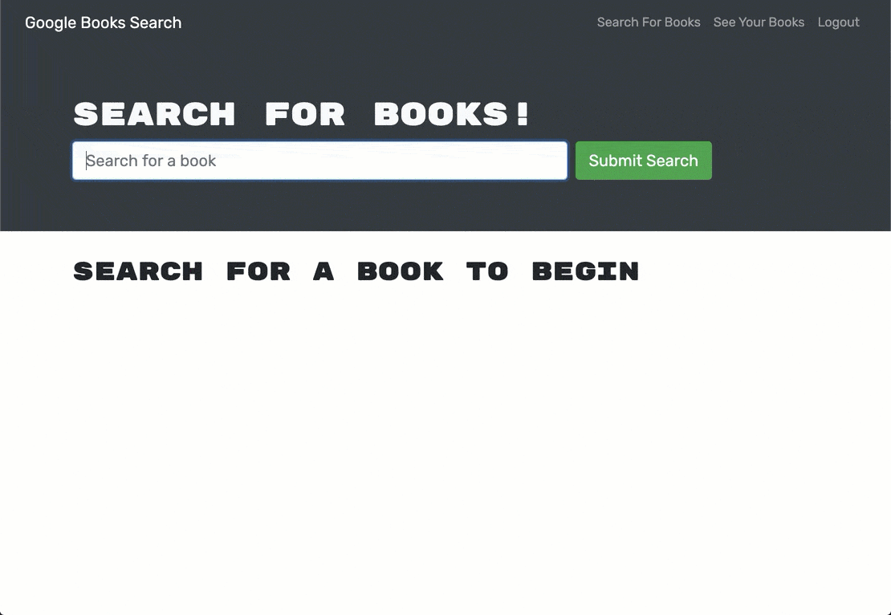

# Book Search Engine

## Description

Taking a fully functioning Google Books API search engine built with a RESTful API, and refactor it to be a GraphQL API built with Apollo Server.

_**Check out the deployed application [here](https://book-search-engine-smp.herokuapp.com/)!**_

## Table of Contents

- [Book Search Engine](#book-search-engine)
  - [Description](#description)
  - [Table of Contents](#table-of-contents)
  - [User Story](#user-story)
  - [Mock-Up](#mock-up)
  - [Acceptance Criteria](#acceptance-criteria)
    - [Additional Criteria](#additional-criteria)
  - [Contributing](#contributing)
  - [Questions](#questions)
  - [License](#license)

## User Story
~~~
AS AN avid reader
I WANT to search for new books to read
SO THAT I can keep a list of books to purchase
~~~

## Acceptance Criteria
~~~
GIVEN a book search engine
WHEN I load the search engine
THEN I am presented with a menu with the options Search for Books and Login/Signup and an input field to search for books and a submit button
WHEN I click on the Search for Books menu option
THEN I am presented with an input field to search for books and a submit button
WHEN I am not logged in and enter a search term in the input field and click the submit button
THEN I am presented with several search results, each featuring a book’s title, author, description, image, and a link to that book on the Google Books site
WHEN I click on the Login/Signup menu option
THEN a modal appears on the screen with a toggle between the option to log in or sign up
WHEN the toggle is set to Signup
THEN I am presented with three inputs for a username, an email address, and a password, and a signup button
WHEN the toggle is set to Login
THEN I am presented with two inputs for an email address and a password and login button
WHEN I enter a valid email address and create a password and click on the signup button
THEN my user account is created and I am logged in to the site
WHEN I enter my account’s email address and password and click on the login button
THEN I the modal closes and I am logged in to the site
WHEN I am logged in to the site
THEN the menu options change to Search for Books, an option to see my saved books, and Logout
WHEN I am logged in and enter a search term in the input field and click the submit button
THEN I am presented with several search results, each featuring a book’s title, author, description, image, and a link to that book on the Google Books site and a button to save a book to my account
WHEN I click on the Save button on a book
THEN that book’s information is saved to my account
WHEN I click on the option to see my saved books
THEN I am presented with all of the books I have saved to my account, each featuring the book’s title, author, description, image, and a link to that book on the Google Books site and a button to remove a book from my account
WHEN I click on the Remove button on a book
THEN that book is deleted from my saved books list
WHEN I click on the Logout button
THEN I am logged out of the site and presented with a menu with the options Search for Books and Login/Signup and an input field to search for books and a submit button
~~~

### Mock-Up
The following images show the web application's appearance and functionality:

As you can see in the following animation, a user can type a search term (in this case, "star wars") in a search box and the results appear:

  
The user can save books by clicking "Save This Book!" under each search result, as shown in the following animation:

  
A user can view their saved books on a separate page, as shown in the following animation:

### Additional Criteria

**Technical Acceptance**

- Satisfies all of the preceding acceptance criteria plus the following:

    - Has an Apollo Server that uses GraphQL queries and mutations to fetch and modify data, replacing the existing RESTful API.
    - Use an Apollo Server and apply it to the Express.js server as middleware.
    - Include schema settings for resolvers and typeDefs as outlined in the Challenge instructions.
    - Modify the existing authentication middleware to work in the context of a GraphQL API.
    - Use an Apollo Provider so that the application can communicate with the Apollo Server.
    - Application must be deployed to Heroku.

**Deployment**

- Application deployed at live URL.
- Application loads with no errors.
- Application GitHub URL submitted.
- GitHub repository contains application code.

**Application Quality**

- User experience is intuitive and easy to navigate.
- User interface style is clean and polished.
- Application resembles the mock-up functionality provided in the Challenge instructions.

**Repository Quality**

- Repository has a unique name.
- Repository follows best practices for file structure and naming conventions.
- Repository follows best practices for class/id naming conventions, indentation, quality comments, etc.
- Repository contains multiple descriptive commit messages.
- Repository contains high-quality README file with description, screenshot, and link to the deployed application.

## Contributing

For any ideas or feedback, please see my contact information [below](#questions).

## Questions

For any questions, please reach out to me through the following resources:

Name: Samuel Pettyjohn  
Title: Developer  
Email: <sammpj47@gmail.com>  
GitHub: <https://github.com/sam-pettyjohn/>  

## License

MIT License

Copyright (c) 2022 Samuel Pettyjohn
            
Permission is hereby granted, free of charge, to any person obtaining a copy
of this software and associated documentation files (the "Software"), to deal
in the Software without restriction, including without limitation the rights
to use, copy, modify, merge, publish, distribute, sublicense, and/or sell
copies of the Software, and to permit persons to whom the Software is
furnished to do so, subject to the following conditions:
            
The above copyright notice and this permission notice shall be included in all
copies or substantial portions of the Software.
            
THE SOFTWARE IS PROVIDED "AS IS", WITHOUT WARRANTY OF ANY KIND, EXPRESS OR
IMPLIED, INCLUDING BUT NOT LIMITED TO THE WARRANTIES OF MERCHANTABILITY,
FITNESS FOR A PARTICULAR PURPOSE AND NONINFRINGEMENT. IN NO EVENT SHALL THE
AUTHORS OR COPYRIGHT HOLDERS BE LIABLE FOR ANY CLAIM, DAMAGES OR OTHER
LIABILITY, WHETHER IN AN ACTION OF CONTRACT, TORT OR OTHERWISE, ARISING FROM,
OUT OF OR IN CONNECTION WITH THE SOFTWARE OR THE USE OR OTHER DEALINGS IN THE
SOFTWARE. 